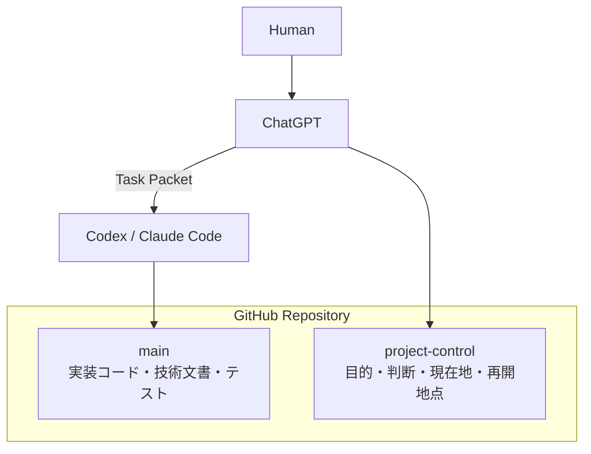

# AI Project Control Starter

ChatGPT / Codex / Claude Code などを使った**長期のAI支援開発**で、プロジェクト全体の目的・判断・現在地と、実装エージェントへ渡す作業コンテキストを分離して管理するためのGitHubスターターです。

長期プロジェクトで起こりがちな「新しいチャットで前提を復元できない」「AIが毎回大量の文書を読み直す」「古い判断と現在の判断が混ざる」といった問題を、GitHub上の小さな **Project Control** で整理します。

## 30秒でわかる

### これは何？

GitHubの2つのブランチを使って、**実装する場所**と**プロジェクトの長期記憶を置く場所**を分けるスターターです。

- `main`: 実装コード、技術文書、テストなどを置く通常の作業ブランチ
- `project-control`: ChatGPTが目的、重要な判断、現在地、再開地点を保持するブランチ

ChatGPTはProject Controlから現在地を復元し、Codex / Claude CodeなどのImplementation Agentには、その作業に必要な情報だけを **Task Packet** として渡します。

### こんな人向け

- ChatGPTとCoding Agentを併用して個人開発・長期開発をしている
- 新しいチャットになるたびにプロジェクト説明をやり直している
- `handoff_2026xxxx.md` のような引き継ぎ文書が増えてきた
- Codex / Claude Codeへプロジェクト全体を毎回読ませたくない
- 「いま何をやっていて、何が決まっているか」をGitHub上で復元できるようにしたい

### 何がうれしい？

- 新しいChatGPTチャットでも `INDEX.md → CURRENT.md` から現在地を復元できる
- Implementation Agentへ渡すコンテキストを作業単位まで小さくできる
- 古い判断と現在の判断を分離しやすい
- 「どの文書が正本か」を `INDEX.md` で明示できる
- Project Controlを日記にせず、過去状態をGit historyへ任せられる

### 2ブランチ構成



**`project-control` はfeature branchではなく、`main`へmergeしません。**

## 使い方の具体例

### 例: 3か月続く個人開発

たとえば、ChatGPTとCodexを使って3か月かけてアプリを開発するとします。

**開始時**

- `project_charter.md` に「何を作るか」「成功状態」「重要な制約」を記録する
- `CURRENT.md` に現在のphase、Goal、再開地点を書く
- 実装コードは通常どおり `main` へ置く

**数週間後、新しいChatGPTチャットへ移ったとき**

1. ChatGPTが `INDEX.md → CURRENT.md` を読む
2. 必要なcanonical documentだけを追加で確認する
3. 現在のGoalと未解決事項を復元する
4. 次の実装作業だけをTask Packetにまとめる
5. Codex / Claude CodeはTask Packetと`main`の実装事実だけを使って作業する
6. 長期的な判断が変わった場合だけ、ChatGPTがProject Controlを更新する

つまり、新しいチャットのたびに人間が「このプロジェクトはですね……」と最初から説明し直すのではなく、**GitHub上の現在地から会話を再開する**ことを狙っています。

## 5分で始める

### 1. テンプレートからリポジトリを作る

このリポジトリの **Use this template** から新しいリポジトリを作成します。

**重要: `Include all branches` を必ずONにしてください。**

このスターターは次の2ブランチをセットで使います。

- `main`
- `project-control`

`Include all branches` をOFFにすると `project-control` が複製されません。

> [!WARNING]
> **このスターターから作る作業用リポジトリは Private で作成してください。**
>
> GitHubの公開範囲はブランチ単位ではなくリポジトリ単位です。作業用リポジトリをPublicにすると、`main`だけでなく、プロジェクトの目的・現在地・重要な判断・再開地点などを保持する **`project-control` ブランチも公開されます。**
>
> アプリ、ライブラリ、Webサイト、ドキュメントなどの**成果物をPublicで公開したい場合は、公開用リポジトリを別に作成し、公開してよい成果物だけをそちらへ配置してください。** 作業用リポジトリそのものをPublicへ変更しないことを、このスターターの標準運用とします。
>
> なお、Privateリポジトリであっても `project-control` にpassword、API key、tokenなどの秘密情報を保存してはいけません。

### 2. 作成後に2ブランチを確認する

新しいリポジトリに `main` と `project-control` があることを確認します。

`project-control` の `docs/project_control/` にテンプレート文書が入っていれば準備完了です。

### 3. ChatGPTで初期設定する

新しいプロジェクトを始めるときは、ChatGPTにリポジトリを参照できる状態で、次のように依頼します。

```text
このリポジトリを新しいプロジェクトとして初期化します。

project-control branch の
1. docs/project_control/INDEX.md
2. docs/project_control/CURRENT.md
3. docs/project_control/project_charter.md
4. docs/project_control/OPERATING_MODEL.md
を確認してください。

テンプレート内のplaceholderを確認し、プロジェクト目的、成功状態、重要な制約、
Human Gateなど、初期化に本当に必要な情報だけを私に質問してください。

回答後、project_charter.md と CURRENT.md を初期化し、
CURRENT.md の implementation_ref を現在の main commit SHA に合わせてください。
Project Controlの更新は project-control branch だけで行い、main へmergeしないでください。
```

※ ChatGPTからGitHubを直接更新できない環境では、変更案を出力して手動で反映してください。

### 4. 2回目以降はINDEXから再開する

新しいチャットを始めるたびに全履歴を説明し直す必要はありません。

```text
このProjectの続きとして再開します。
project-control branch の docs/project_control/INDEX.md → CURRENT.md の順で読み、
INDEXが現在の正本として指定している必要な文書だけを追加で確認してください。
実装判断が必要な場合のみ committed main を確認してください。
現在地を復元し、次に進めるべき作業を判断してください。
```

## 仕組み

長期的な文脈と、実装作業のコンテキストを分けます。

```text
Human
  │ 目的・重要判断・Human Gate
  ▼
ChatGPT
  │ Project Control + committed main を参照
  │ 必要情報だけを Task Packet にまとめる
  ▼
Codex / Claude Code / other Implementation Agent
  │ main 上で調査・実装・テスト
  ▼
ChatGPT
  │ 結果をレビュー
  └─ 必要な意味の変化だけ Project Control を更新
```

### `main`

通常の実装作業を行う場所です。

- source code
- stable technical docs
- tests
- build / runtime configuration
- Implementation Agentの通常作業

### `project-control`

ChatGPTが長期的なプロジェクト文脈を復元するための **persistent brain** です。

feature branchではなく、`main`へmergeしません。

主に次を保持します。

- プロジェクトの目的と境界
- 現在の作業範囲と再開地点
- 長く有効な判断と、その理由
- 何が確定し、何が未解決か
- テーマごとの正本（canonical document）
- 将来、判断を見直す条件

## なぜImplementation AgentにProject Controlを直接読ませないのか

Codex / Claude Codeなどの実装エージェントには、原則として `project-control` を直接読ませません。

ChatGPTがProject Controlとcommitted `main`から、その作業に必要な情報だけを **Task Packet** にまとめて渡します。

これにより、次を減らします。

- 毎回の大量読み込みによるトークン消費
- 古い判断や無関係な文脈の混入
- 作業範囲の不用意な拡大
- プロジェクト全体の解釈を複数エージェントが別々に行うこと

`main` の `AGENTS.md` が、この境界をImplementation Agentへ伝える入口です。Claude Code向けの `CLAUDE.md` は `AGENTS.md` を参照します。

## Task Packet

Task PacketはProject Controlのコピーではありません。

1回の作業に必要な情報だけをまとめた作業契約です。必要に応じて次を含めます。

- Goal
- Scope / Non-goals
- relevant canonical facts
- Constraints
- Human Gates
- Acceptance criteria
- Verification requirements
- Stop conditions

詳細は `project-control` ブランチの `docs/project_control/prompt_policy.md` を参照してください。

## Project Controlの読み順

新しいChatGPTチャットでは、原則として次の順に確認します。

1. `docs/project_control/INDEX.md`
2. `docs/project_control/CURRENT.md`
3. INDEXが現在の正本として指定する対象文書
4. 必要な場合だけcheckpoint / legacy reference
5. 実装判断が必要な場合だけcommitted `main`

Project Control全文を毎回読む設計にはしていません。

## ファイル構成

### `main`

- `README.md` — このスターターの説明と導入手順
- `AGENTS.md` — Implementation AgentとProject Controlの境界
- `CLAUDE.md` — Claude Code向けの入口
- `SECURITY.md` — 秘密情報を扱わないための注意事項
- `.gitignore` — 代表的な秘密設定・ローカルデータ・生成物を除外

### `project-control`

- `docs/project_control/INDEX.md` — 起動入口と正本マップ
- `docs/project_control/CURRENT.md` — 現在地、現在の作業範囲、再開地点
- `docs/project_control/OPERATING_MODEL.md` — Human / ChatGPT / Implementation Agentの役割と境界
- `docs/project_control/project_charter.md` — プロジェクト目的、成功条件、Human Authority
- `docs/project_control/prompt_policy.md` — Task Packetの作成方針
- `docs/project_control/chatgpt_entrypoint.md` — INDEXへの互換入口

## セキュリティ

**`project-control` はセキュリティ境界ではありません。**

実装エージェントから通常分離しているのは、長期文脈の混入や不要なトークン消費を避けるためです。秘密情報を保存する場所ではありません。

### リポジトリの公開範囲に注意

このスターターから作成する作業用リポジトリは **Private** を前提とします。

GitHubでリポジトリをPublicにすると、`project-control` を含むすべてのブランチが公開されます。成果物を公開する場合は、公開専用の別リポジトリを用意してください。

次のような情報はcommitしないでください。

- `.env`
- API key / access token
- password / session cookie
- private key
- 実データを含むdatabase
- 個人情報や機密情報を含むraw export / log / screenshot

秘密情報はGitHub Secrets、環境変数、password managerなど、用途に合った仕組みへ分離してください。

## 設計上の考え方

Project Control自体を大きく育てることが目的ではありません。

「次のチャットが正しい現在地を復元できるだけの意味・判断」を残し、過去状態は原則としてGit historyに任せます。`CURRENT.md`を日記のように追記し続けたり、日付付きhandoff文書を無制限に増やしたりしないことを前提にしています。

## License

MIT License
